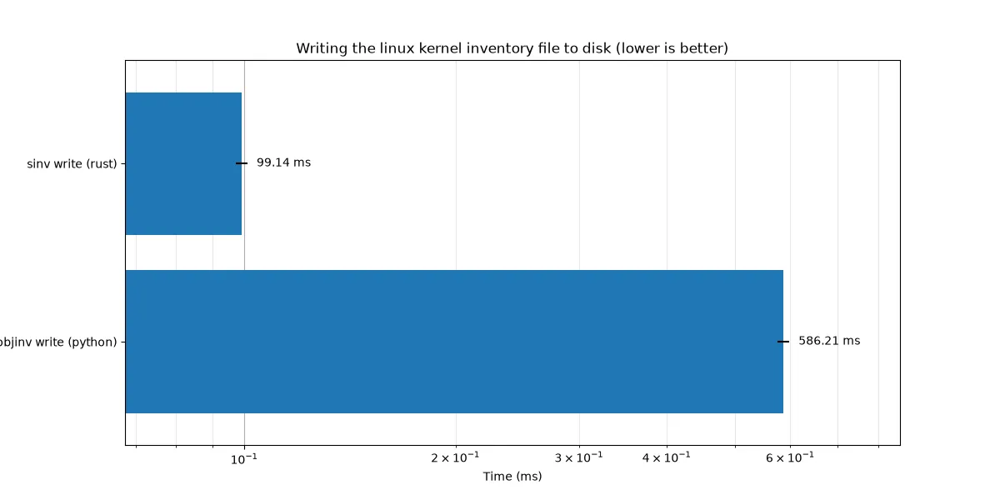
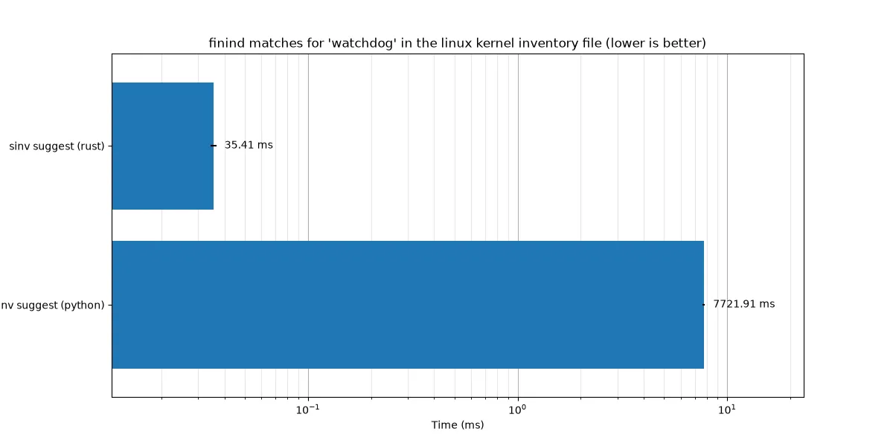

# sinv

[](https://opensource.org/licenses/MIT)
[](https://codecov.io/gh/aslowwriter/sinv)
[](https://crates.io/crates/sinv)


A CLI toolkit for handling Sphinx inventory files. It is modeled after [sphobjinv](https://sphobjinv.readthedocs.io/en/stable/) but has several improvements over it:

1. it is up to 200x faster (see [benchmarks](#benchmarks))
2. it supports colourised output
3. it is easier to pronounce (ess-inv)


## Installation

You can install the binary simply form PyPi using your favourite method:

```
uv tool install sinv
```

If you prefer you can also install it from crates.io:


```
cargo install sinv
```

If you wish you can also of course build it from source:

```
cargo install --git https://github.com/aslowwriter/sinv
```

though I am also planning more distribution channels like crates.io, conda-forge and possibly pypi.

## Usage

Currently `sinv` has two subcommands:
### write
`write` is used to find and retrieve inventory files from various sources and write them in the appropriate place in the appropriate format. This can be used to easily modify them as shown in the demo.

For example:
```bash
sinv write - foo.inv # input over std output to file
sinv write https://docs.kernel.org/objects.inv - # read from url, output over stdout
sinv write foo.inv foo.txt -e plain # convert foo.inv to plain-text version you can edit
```

By default the output will be the standard zlib format. `sinv` will use the Sphinx shorthand (`$` and `-` as standin for display name) to compress the output in a way Sphinx expects when outputting to zlib by default. This can also be enabled by using the `-m` flag when outputting to plain-text


### suggest
`suggest` suggest is for fuzzy finding entries in your inventory files if you're looking for a particular one.

for example you can search in the linux kernel docs for entries containing the word "watchdog" and return the top 5 matches that have at least a score of 100 (scoring is dependant on the length of your query) like so:
```bash
sinv suggest watchdog https://docs.kernel.org/objects.inv -m 5 -t 100
```

Note that `sinv` will only output colours if it detects your terminal can support it. These decisions can be overridden by setting either the `NO_COLOR` or `FORCE_COLOR` environment variable.

### textconv
Sphobjinv also includes a textconv utility for viewing diffs of inventory files. This is also implemented, but given that it had some unique design constraints it was published as a separate project [here](https://github.com/aslowwriter/sinv-textconv)

## FAQ

### Q: I have a file that isn't parsing!

A: Since this is written in a compiled language we can't easily install extensions like Python can, therefore it is very possible that you have a valid file that isn't parsing correctly. Because there is a lot of extensions out there and it is unclear how many of them are still actively used we limited ourselves to a few of the bigger projects (like `http`, `sip` provided by PyQt, and `cmake`). If you have one that we don't support yet, please [open an issue at sphinx_inv (the parser)](https://github.com/aslowwriter/sphinx_inv/issues/new), we'd love to fix it!


### Q: What's the status of the project?

A: Currently the project is mostly "done." That means that it does what I need it to do for now, so it may not see regular updates. However, I'm happy to take bug reports and feature requests, and may implement functionalities as needed. The project is still maintained, but I'd rather wait to have actual usecases we can address properly rather than implement a bunch of features nobody is interested in.

### Q: Can I use this in my Python code?

A: Not currently because I haven't had a need for that. However, I see no reason it couldn't be made available if anyone would like it. So if you want to use it from Python, please open a feature request.


## Benchmarks

Below are two comparisons between `sinv` and `sphobjinv`:





To run the benchmarks we recommend you have the following tools installed (though only hyperfine, cargo, and sphobjinv are required):

- [cargo](https://rust-lang.org) to compile the project
- [hyperfine](https://github.com/sharkdp/hyperfine) for running the benchmarks and generating the timing data
- [uv](https://github.com/astral-sh/uv) to manage the dependencies of and run the Python script for generating the plot
- [just](https://github.com/casey/just) to run the commands
- [curl](https://github.com/curl/curl) for downloading the objects.inv file

if you have all these, running the benchmarks should be as easy as

```
just benchmark
```

this will:
1. download the linux kernel docs inventory file
2. compile the binary
3. use hyperfine to run the benchmarks
4. run the plotting script through uv

if you want to benchmark a different `objects.inv` file all you have to do is replace the url in this line of the `justfile` :

```
curl -Lo objects.inv https://docs.kernel.org/objects.inv
```

Note: due to differences in hardware or parsing files, the actual value of the timings may be quite different than the ones in the plot, but the relative ordering of the implementations should remain the same.

## Acknowledgements

- Thank you to Brian Skinn et al. for writing sphobjinv and documenting [the Sphinx inventory](https://sphobjinv.readthedocs.io/en/stable/syntax.html) format
  They have been invaluable in writing this application

## Template

This repo was initially setup using [`cargo-generate`](https://github.com/cargo-generate/cargo-generate) and [this template](https://github.com/aslowwriter/rust-template)
